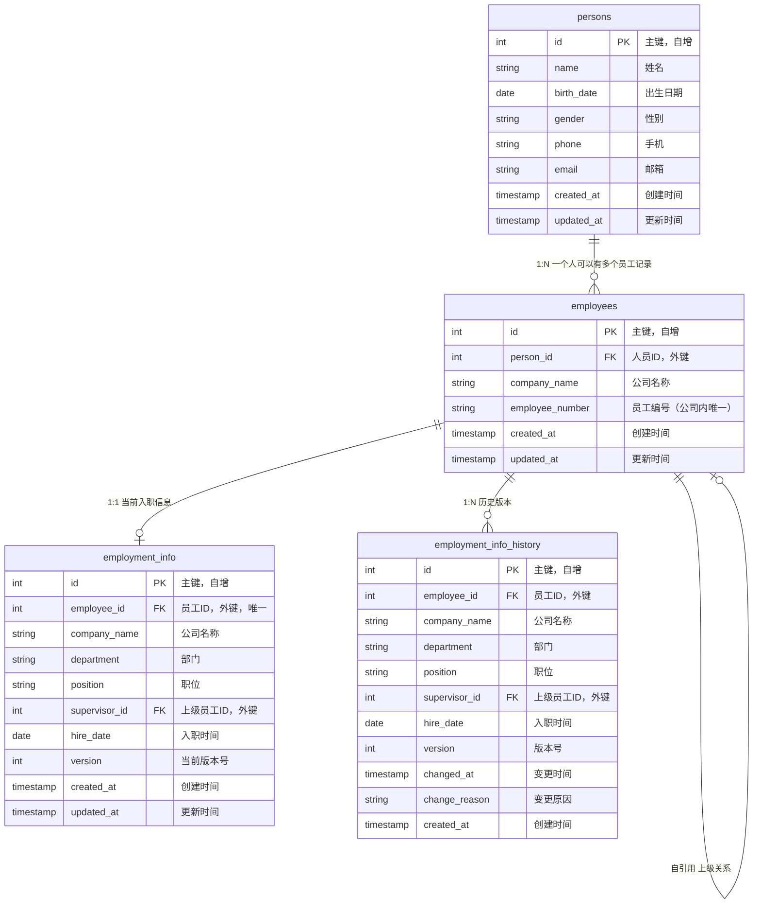

# 人事管理系统

一个基于 Python 和 Flask 的 Web 人事管理系统，支持跨平台访问。

## 功能特性

### 已实现功能

1. **员工基本信息管理**
   - 个人信息（不变动）：姓名、出生日期、性别、手机、邮箱、员工编号
   - 入职信息（会变动）：部门、职位、上级、入职时间
   - 支持新增、编辑、删除员工
   - 入职信息变更自动记录历史版本

2. **入职信息版本管理**
   - 每次入职信息变更都会记录历史版本
   - 可以查看员工的入职信息变更历史
   - 变更时支持填写变更原因

## 技术栈

- Python 3.12+
- Flask - Web 框架
- SQLite - 数据库
- HTML/CSS/JavaScript - 前端界面

## 安装依赖

```bash
pip install -r requirements.txt
```

## 运行应用

```bash
python main.py
```

应用启动后，在浏览器中访问：`http://localhost:5000`

## 数据库

数据库文件默认存储在：
- **macOS**: `~/Library/Application Support/HRSystem/hr_system.db`
- **Windows**: `%APPDATA%/HRSystem/hr_system.db`
- **Linux**: `~/.hrsystem/hr_system.db`

## 项目结构

```
ndscguys/
├── main.py                 # 主程序入口
├── config.py               # 应用配置文件
├── init_database.py        # 测试数据生成脚本
├── app/                    # Flask 应用包
│   ├── __init__.py         # 应用工厂
│   ├── routes.py           # 路由蓝图
│   ├── database.py         # 数据库初始化和连接管理
│   ├── models/             # 数据模型类
│   │   ├── __init__.py
│   │   ├── employee.py
│   │   ├── employment_info.py
│   │   └── employment_info_history.py
│   ├── services/           # 业务逻辑层
│   │   ├── __init__.py
│   │   └── employee_service.py
│   ├── templates/          # HTML 模板
│   │   └── index.html
│   └── static/             # 静态文件
│       ├── css/
│       │   └── style.css
│       └── js/
│           └── main.js
└── requirements.txt        # 依赖包列表
```

### 项目结构说明

本项目采用 **Flask 应用工厂模式**，具有以下优势：

- **模块化设计**：代码按功能分层，易于维护和扩展
- **配置管理**：通过 `config.py` 统一管理配置，支持多环境
- **蓝图分离**：路由使用蓝图组织，代码更清晰
- **易于测试**：应用工厂模式便于单元测试
- **符合规范**：遵循 Flask 最佳实践

## 数据模型

### 实体关系图（ERD）



### 模型设计说明

#### 1. persons 表（人员基本信息）
**设计理念**：存储人员的不变信息（姓名、出生日期、性别、手机、邮箱等）。这些信息在人员级别是唯一的，不随公司变化。同一个人在不同公司工作时，共享同一条人员记录。

| 字段 | 类型 | 说明 | 约束 |
|------|------|------|------|
| id | INTEGER | 主键 | PRIMARY KEY, AUTOINCREMENT |
| name | TEXT | 姓名 | NOT NULL |
| birth_date | DATE | 出生日期 | - |
| gender | TEXT | 性别 | - |
| phone | TEXT | 手机 | - |
| email | TEXT | 邮箱 | - |
| created_at | TIMESTAMP | 创建时间 | DEFAULT CURRENT_TIMESTAMP |
| updated_at | TIMESTAMP | 更新时间 | DEFAULT CURRENT_TIMESTAMP |

**索引**：`idx_person_name` 在 `name` 字段上

#### 2. employees 表（员工记录）
**设计理念**：存储员工在公司中的记录。一个人可以在多个公司工作，每个公司对应一条员工记录。员工编号在公司内唯一。

| 字段 | 类型 | 说明 | 约束 |
|------|------|------|------|
| id | INTEGER | 主键 | PRIMARY KEY, AUTOINCREMENT |
| person_id | INTEGER | 人员ID | FOREIGN KEY → persons(id), NOT NULL |
| company_name | TEXT | 公司名称 | NOT NULL |
| employee_number | TEXT | 员工编号 | NOT NULL |
| created_at | TIMESTAMP | 创建时间 | DEFAULT CURRENT_TIMESTAMP |
| updated_at | TIMESTAMP | 更新时间 | DEFAULT CURRENT_TIMESTAMP |

**关系说明**：
- `person_id` 与 `persons.id` 多对一关系（一个人可以有多个员工记录）
- `UNIQUE(company_name, employee_number)` 确保员工编号在公司内唯一

**索引**：
- `idx_employee_person_id` 在 `person_id` 字段上
- `idx_employee_company` 在 `company_name` 字段上

#### 3. employment_info 表（当前入职信息）
**设计理念**：存储员工当前的入职信息，这些信息会随着员工职位变动而变更。每次变更都会在历史表中记录。

| 字段 | 类型 | 说明 | 约束 |
|------|------|------|------|
| id | INTEGER | 主键 | PRIMARY KEY, AUTOINCREMENT |
| employee_id | INTEGER | 员工ID | FOREIGN KEY → employees(id), UNIQUE, NOT NULL |
| company_name | TEXT | 公司名称 | NOT NULL |
| department | TEXT | 部门 | NOT NULL |
| position | TEXT | 职位 | NOT NULL |
| supervisor_id | INTEGER | 上级员工ID | FOREIGN KEY → employees(id), ON DELETE SET NULL |
| hire_date | DATE | 入职时间 | NOT NULL |
| version | INTEGER | 当前版本号 | NOT NULL, DEFAULT 1 |
| created_at | TIMESTAMP | 创建时间 | DEFAULT CURRENT_TIMESTAMP |
| updated_at | TIMESTAMP | 更新时间 | DEFAULT CURRENT_TIMESTAMP |

**关系说明**：
- `employee_id` 与 `employees.id` 一对一关系（一个员工只有一条当前入职信息）
- `supervisor_id` 自引用 `employees.id`（上级也是员工，且应在同一公司）
- `UNIQUE(employee_id)` 确保每个员工只有一条当前记录

**索引**：`idx_employment_employee_id` 在 `employee_id` 字段上

#### 4. employment_info_history 表（入职信息历史）
**设计理念**：记录员工入职信息的所有历史版本，实现完整的变更追踪。每次 `employment_info` 更新时，旧版本会自动保存到此表。

| 字段 | 类型 | 说明 | 约束 |
|------|------|------|------|
| id | INTEGER | 主键 | PRIMARY KEY, AUTOINCREMENT |
| employee_id | INTEGER | 员工ID | FOREIGN KEY → employees(id), NOT NULL |
| company_name | TEXT | 公司名称 | NOT NULL |
| department | TEXT | 部门 | NOT NULL |
| position | TEXT | 职位 | NOT NULL |
| supervisor_id | INTEGER | 上级员工ID | FOREIGN KEY → employees(id), ON DELETE SET NULL |
| hire_date | DATE | 入职时间 | NOT NULL |
| version | INTEGER | 版本号 | NOT NULL |
| changed_at | TIMESTAMP | 变更时间 | DEFAULT CURRENT_TIMESTAMP |
| change_reason | TEXT | 变更原因 | - |
| created_at | TIMESTAMP | 创建时间 | DEFAULT CURRENT_TIMESTAMP |

**关系说明**：
- `employee_id` 与 `employees.id` 一对多关系（一个员工可以有多个历史版本）
- `version` 字段与 `employment_info.version` 对应，记录历史版本号

**索引**：
- `idx_history_employee_id` 在 `employee_id` 字段上
- `idx_history_version` 在 `(employee_id, version)` 复合字段上

## 已知问题

### 换公司逻辑设计问题

**问题描述**：
当前实现中，换公司时使用了 `transfer_employee_to_company` 方法，该方法会：
1. 更新 `employees` 表的 `company_name` 和 `employee_number`
2. 更新 `employment_info` 表的 `company_name` 和其他字段

**存在的问题**：
- `employees` 表有 `UNIQUE(company_name, employee_number)` 约束，这意味着同一个员工编号只能在一个公司中存在
- 如果一个人换公司，但新公司中已经有相同的员工编号，会导致唯一约束冲突
- 换公司时，员工编号是否需要改变？如果改变，如何保证编号的唯一性和连续性？
- 当前设计没有明确区分"员工记录"和"任职信息"的关系，换公司时是否需要创建新的员工记录？

**待修正方向**：
1. 明确换公司的业务逻辑：是更新现有记录还是创建新记录？
2. 如果创建新记录，如何处理 `person_id` 的关联？
3. 如果更新现有记录，如何处理员工编号的唯一性约束？
4. 考虑是否需要引入"离职"状态，而不是直接删除或更新记录

### 数据关系说明

1. **人员与员工（1:N）**
   - 一个人可以在多个公司工作，每个公司对应一条员工记录
   - 通过 `person_id` 关联，可以查询一个人在所有公司的工作经历
   - 删除人员时，级联删除所有员工记录（`ON DELETE CASCADE`）

2. **员工与当前入职信息（1:1）**
   - 每个员工有且仅有一条当前入职信息
   - 通过 `UNIQUE(employee_id)` 约束保证
   - 删除员工时，级联删除入职信息（`ON DELETE CASCADE`）

3. **员工与历史版本（1:N）**
   - 每个员工可以有多个历史版本记录
   - 每次入职信息变更时，旧版本自动保存到历史表
   - 删除员工时，级联删除所有历史记录

4. **员工自引用关系（上级关系）**
   - `supervisor_id` 指向另一个员工的 `id`
   - 形成组织架构的层级关系
   - 上级和下级应在同一公司（应用层验证）
   - 删除上级员工时，下级员工的 `supervisor_id` 设置为 NULL（`ON DELETE SET NULL`）

5. **多公司支持**
   - 员工编号在公司内唯一：`UNIQUE(company_name, employee_number)`
   - 同一个人在不同公司工作时，会创建不同的员工记录
   - 可以通过 `person_id` 查询一个人在所有公司的工作历史

### 版本管理机制

当员工入职信息发生变更时：

1. **读取当前版本**：从 `employment_info` 获取当前信息
2. **保存历史版本**：将当前信息（包括版本号）插入到 `employment_info_history`
3. **更新当前版本**：更新 `employment_info` 表，版本号 +1
4. **记录变更原因**：在历史表中保存 `change_reason`

这样可以完整追踪每个员工的职位变更历史，包括变更时间、变更原因等。

## 使用说明

1. **新增员工**
   - 点击"新增员工"按钮
   - 填写个人信息和入职信息
   - 点击"保存"

2. **编辑员工**
   - 在员工列表中选择要编辑的员工
   - 点击"编辑员工"按钮
   - 修改信息后点击"保存"
   - 如果修改了入职信息，系统会自动记录历史版本

3. **删除员工**
   - 在员工列表中选择要删除的员工
   - 点击"删除员工"按钮
   - 确认删除操作

## 待实现功能

- 薪资计算功能
- 薪资发放记录
- 历史记录查询界面
- 报表统计功能

