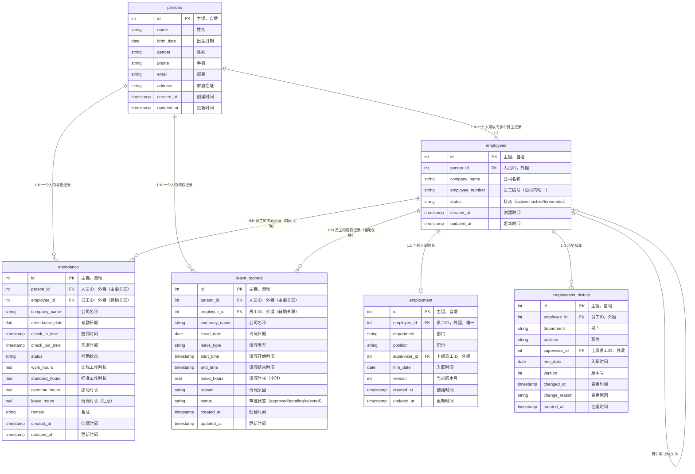

# 人事管理系统

一个基于 Python 和 Flask 的 Web 人事管理系统，支持跨平台访问。

## 功能特性

### 已实现功能

1. **人员管理**
   - 个人信息管理：姓名、出生日期、性别、手机、邮箱、家庭住址
   - 支持新增、编辑、查询人员信息
   - 人员信息与员工记录分离，支持跨公司工作历史追踪

2. **员工管理**
   - 员工记录关联到人员和公司
   - 支持多公司员工管理
   - 员工状态管理（active/inactive/terminated）

3. **任职信息管理**
   - 当前任职信息：部门、职位、上级、入职时间
   - 支持新增、编辑、删除员工
   - 入职信息变更自动记录历史版本
   - 每次变更都会记录历史版本和变更原因
   - 支持查看完整的任职历史（包括换公司记录）

4. **考勤管理**
   - 考勤记录管理：签到时间、签退时间、工作时长、加班时长
   - 自动计算工作时长和加班时长
   - 自动判断考勤状态（正常、迟到、早退、缺勤、请假等）
   - 支持按日期范围、公司、人员查询考勤记录
   - 考勤记录关联到人员（person_id），避免换公司带来的数据分散问题

5. **请假管理**
   - 请假记录管理：请假类型、请假时长、请假原因
   - 支持多种请假类型（病假、事假、年假、调休、产假、婚假等）
   - 支持部分请假（按小时计算）
   - 请假记录自动汇总到对应日期的考勤记录
   - 请假记录关联到人员（person_id），支持跨公司请假历史查询

## 技术栈

- Python 3.12+
- Flask - Web 框架
- SQLite - 数据库
- HTML/CSS/JavaScript - 前端界面

## 安装依赖

```bash
pip install -r requirements.txt
```

## 运行应用

```bash
python main.py
```

应用启动后，在浏览器中访问：`http://localhost:5000`

## 数据库

数据库文件默认存储在：
- **macOS**: `~/Library/Application Support/HRSystem/hr_system.db`
- **Windows**: `%APPDATA%/HRSystem/hr_system.db`
- **Linux**: `~/.hrsystem/hr_system.db`

## 项目结构

```
ndscguys/
├── main.py                 # 主程序入口
├── config.py               # 应用配置文件
├── init_database.py        # 测试数据生成脚本
├── app/                    # Flask 应用包
│   ├── __init__.py         # 应用工厂
│   ├── routes.py           # 路由蓝图
│   ├── database.py         # 数据库初始化和连接管理
│   ├── models/             # 数据模型类
│   │   ├── __init__.py
│   │   ├── person.py
│   │   ├── employee.py
│   │   ├── employment.py
│   │   ├── employment_history.py
│   │   ├── attendance.py
│   │   └── leave_record.py
│   ├── daos/               # 数据访问层
│   │   ├── __init__.py
│   │   ├── base_dao.py
│   │   ├── person_dao.py
│   │   ├── employee_dao.py
│   │   ├── employment_dao.py
│   │   ├── attendance_dao.py
│   │   └── leave_record_dao.py
│   ├── services/           # 业务逻辑层
│   │   ├── __init__.py
│   │   ├── employee_service.py
│   │   └── attendance_service.py
│   ├── templates/          # HTML 模板
│   │   ├── employees.html
│   │   ├── persons.html
│   │   └── attendance.html
│   └── static/             # 静态文件
│       ├── css/
│       │   └── style.css
│       └── js/
│           ├── employees.js
│           ├── persons.js
│           └── attendance.js
└── requirements.txt        # 依赖包列表
```

### 项目结构说明

本项目采用 **Flask 应用工厂模式**，具有以下优势：

- **模块化设计**：代码按功能分层，易于维护和扩展
- **配置管理**：通过 `config.py` 统一管理配置，支持多环境
- **蓝图分离**：路由使用蓝图组织，代码更清晰
- **易于测试**：应用工厂模式便于单元测试
- **符合规范**：遵循 Flask 最佳实践

## 数据模型

### 实体关系图（ERD）



### 模型设计说明

#### 1. persons 表（人员基本信息）
**设计理念**：存储人员的不变信息（姓名、出生日期、性别、手机、邮箱、家庭住址等）。这些信息在人员级别是唯一的，不随公司变化。同一个人在不同公司工作时，共享同一条人员记录。

| 字段 | 类型 | 说明 | 约束 |
|------|------|------|------|
| id | INTEGER | 主键 | PRIMARY KEY, AUTOINCREMENT |
| name | TEXT | 姓名 | NOT NULL |
| birth_date | DATE | 出生日期 | - |
| gender | TEXT | 性别 | - |
| phone | TEXT | 手机 | - |
| email | TEXT | 邮箱 | - |
| address | TEXT | 家庭住址 | - |
| created_at | TIMESTAMP | 创建时间 | DEFAULT CURRENT_TIMESTAMP |
| updated_at | TIMESTAMP | 更新时间 | DEFAULT CURRENT_TIMESTAMP |

**索引**：`idx_person_name` 在 `name` 字段上

#### 2. employees 表（员工记录）
**设计理念**：存储员工在公司中的记录。一个人可以在多个公司工作，每个公司对应一条员工记录。员工编号在公司内唯一。

| 字段 | 类型 | 说明 | 约束 |
|------|------|------|------|
| id | INTEGER | 主键 | PRIMARY KEY, AUTOINCREMENT |
| person_id | INTEGER | 人员ID | FOREIGN KEY → persons(id), NOT NULL |
| company_name | TEXT | 公司名称 | NOT NULL |
| employee_number | TEXT | 员工编号 | NOT NULL |
| status | TEXT | 状态 | DEFAULT 'active' |
| created_at | TIMESTAMP | 创建时间 | DEFAULT CURRENT_TIMESTAMP |
| updated_at | TIMESTAMP | 更新时间 | DEFAULT CURRENT_TIMESTAMP |

**关系说明**：
- `person_id` 与 `persons.id` 多对一关系（一个人可以有多个员工记录）
- `UNIQUE(company_name, employee_number)` 确保员工编号在公司内唯一

**索引**：
- `idx_employee_person_id` 在 `person_id` 字段上
- `idx_employee_company` 在 `company_name` 字段上

#### 3. employment 表（当前入职信息）
**设计理念**：存储员工当前的入职信息，这些信息会随着员工职位变动而变更。每次变更都会在历史表中记录。

| 字段 | 类型 | 说明 | 约束 |
|------|------|------|------|
| id | INTEGER | 主键 | PRIMARY KEY, AUTOINCREMENT |
| employee_id | INTEGER | 员工ID | FOREIGN KEY → employees(id), UNIQUE, NOT NULL |
| department | TEXT | 部门 | NOT NULL |
| position | TEXT | 职位 | NOT NULL |
| supervisor_id | INTEGER | 上级员工ID | FOREIGN KEY → employees(id), ON DELETE SET NULL |
| hire_date | DATE | 入职时间 | NOT NULL |
| version | INTEGER | 当前版本号 | NOT NULL, DEFAULT 1 |
| created_at | TIMESTAMP | 创建时间 | DEFAULT CURRENT_TIMESTAMP |
| updated_at | TIMESTAMP | 更新时间 | DEFAULT CURRENT_TIMESTAMP |

**关系说明**：
- `employee_id` 与 `employees.id` 一对一关系（一个员工只有一条当前入职信息）
- `supervisor_id` 自引用 `employees.id`（上级也是员工，且应在同一公司）
- `UNIQUE(employee_id)` 确保每个员工只有一条当前记录

**索引**：`idx_employment_employee_id` 在 `employee_id` 字段上

#### 4. employment_history 表（入职信息历史）
**设计理念**：记录员工入职信息的所有历史版本，实现完整的变更追踪。每次 `employment` 更新时，旧版本会自动保存到此表。

| 字段 | 类型 | 说明 | 约束 |
|------|------|------|------|
| id | INTEGER | 主键 | PRIMARY KEY, AUTOINCREMENT |
| employee_id | INTEGER | 员工ID | FOREIGN KEY → employees(id), NOT NULL |
| department | TEXT | 部门 | NOT NULL |
| position | TEXT | 职位 | NOT NULL |
| supervisor_id | INTEGER | 上级员工ID | FOREIGN KEY → employees(id), ON DELETE SET NULL |
| hire_date | DATE | 入职时间 | NOT NULL |
| version | INTEGER | 版本号 | NOT NULL |
| changed_at | TIMESTAMP | 变更时间 | DEFAULT CURRENT_TIMESTAMP |
| change_reason | TEXT | 变更原因 | - |
| created_at | TIMESTAMP | 创建时间 | DEFAULT CURRENT_TIMESTAMP |

**关系说明**：
- `employee_id` 与 `employees.id` 一对多关系（一个员工可以有多个历史版本）
- `version` 字段与 `employment.version` 对应，记录历史版本号

**索引**：
- `idx_history_employee_id` 在 `employee_id` 字段上
- `idx_history_version` 在 `(employee_id, version)` 复合字段上

#### 5. attendance 表（考勤记录）
**设计理念**：记录人员的考勤信息，关联到 `person_id` 而非 `employee_id`，避免换公司时考勤数据分散。支持自动计算工作时长、加班时长，并自动汇总请假时长。

| 字段 | 类型 | 说明 | 约束 |
|------|------|------|------|
| id | INTEGER | 主键 | PRIMARY KEY, AUTOINCREMENT |
| person_id | INTEGER | 人员ID | FOREIGN KEY → persons(id), NOT NULL |
| employee_id | INTEGER | 员工ID | FOREIGN KEY → employees(id), ON DELETE SET NULL |
| company_name | TEXT | 公司名称 | NOT NULL |
| attendance_date | DATE | 考勤日期 | NOT NULL |
| check_in_time | TIMESTAMP | 签到时间 | - |
| check_out_time | TIMESTAMP | 签退时间 | - |
| status | TEXT | 考勤状态 | - |
| work_hours | REAL | 实际工作时长（小时） | - |
| standard_hours | REAL | 标准工作时长（小时） | DEFAULT 8.0 |
| overtime_hours | REAL | 加班时长（小时） | DEFAULT 0.0 |
| leave_hours | REAL | 请假时长（小时，汇总） | DEFAULT 0.0 |
| remark | TEXT | 备注 | - |
| created_at | TIMESTAMP | 创建时间 | DEFAULT CURRENT_TIMESTAMP |
| updated_at | TIMESTAMP | 更新时间 | DEFAULT CURRENT_TIMESTAMP |

**关系说明**：
- `person_id` 与 `persons.id` 多对一关系（主要关联，一个人的所有考勤记录集中管理）
- `employee_id` 与 `employees.id` 多对一关系（辅助关联，用于快速查询当前公司的考勤）
- `UNIQUE(person_id, company_name, attendance_date)` 确保一个人一天在一个公司只有一条记录

**索引**：
- `idx_attendance_person_id` 在 `person_id` 字段上
- `idx_attendance_employee_id` 在 `employee_id` 字段上
- `idx_attendance_date` 在 `attendance_date` 字段上
- `idx_attendance_company` 在 `company_name` 字段上

**考勤状态**：
- `normal`: 正常
- `late`: 迟到
- `early_leave`: 早退
- `absent`: 缺勤
- `leave`: 请假（全天）
- `partial_leave`: 部分请假
- `incomplete`: 未完成（有签到无签退）
- `overtime`: 加班

#### 6. leave_records 表（请假记录）
**设计理念**：记录人员的请假信息，支持一天内多次请假。请假记录关联到 `person_id`，避免换公司时请假数据分散。请假时长自动汇总到对应日期的考勤记录。

| 字段 | 类型 | 说明 | 约束 |
|------|------|------|------|
| id | INTEGER | 主键 | PRIMARY KEY, AUTOINCREMENT |
| person_id | INTEGER | 人员ID | FOREIGN KEY → persons(id), NOT NULL |
| employee_id | INTEGER | 员工ID | FOREIGN KEY → employees(id), ON DELETE SET NULL |
| company_name | TEXT | 公司名称 | NOT NULL |
| leave_date | DATE | 请假日期 | NOT NULL |
| leave_type | TEXT | 请假类型 | NOT NULL |
| start_time | TIMESTAMP | 请假开始时间 | - |
| end_time | TIMESTAMP | 请假结束时间 | - |
| leave_hours | REAL | 请假时长（小时） | NOT NULL |
| reason | TEXT | 请假原因 | - |
| status | TEXT | 审批状态 | DEFAULT 'approved' |
| created_at | TIMESTAMP | 创建时间 | DEFAULT CURRENT_TIMESTAMP |
| updated_at | TIMESTAMP | 更新时间 | DEFAULT CURRENT_TIMESTAMP |

**关系说明**：
- `person_id` 与 `persons.id` 多对一关系（主要关联，一个人的所有请假记录集中管理）
- `employee_id` 与 `employees.id` 多对一关系（辅助关联，用于快速查询当前公司的请假）
- 一个人员一天可以有多次请假记录（例如：上午请假2小时，下午请假2小时）

**索引**：
- `idx_leave_person_id` 在 `person_id` 字段上
- `idx_leave_employee_id` 在 `employee_id` 字段上
- `idx_leave_date` 在 `leave_date` 字段上
- `idx_leave_company` 在 `company_name` 字段上

**请假类型**：病假、事假、年假、调休、产假、婚假等

**审批状态**：`approved`（已批准）、`pending`（待审批）、`rejected`（已拒绝）

## 设计说明

### 考勤和请假记录关联到 Person 的设计考虑

**为什么考勤和请假记录关联到 `person_id` 而不是 `employee_id`？**

1. **避免换公司带来的数据分散问题**
   - 如果关联到 `employee_id`，当员工换公司时，会创建新的 `employee` 记录
   - 旧的考勤记录关联到旧的 `employee_id`，新的考勤记录关联到新的 `employee_id`
   - 查询一个人的完整考勤历史需要跨多个 `employee` 记录，逻辑复杂

2. **数据完整性**
   - 关联到 `person_id` 后，一个人的所有考勤记录（跨公司）都集中在一个地方
   - 查询简单：直接通过 `person_id` 查询即可
   - 不受换公司影响，历史记录完整

3. **业务逻辑清晰**
   - 考勤记录本质上是"人的工作记录"，而非"公司记录"
   - 即使换公司，考勤记录仍然属于同一个人

**辅助字段 `employee_id` 的作用**：
- 用于快速查询当前公司的考勤记录
- 用于关联当前员工信息（如员工编号、公司名称等）
- 可选字段，删除员工时设置为 NULL，不影响考勤记录

### 数据关系说明

1. **人员与员工（1:N）**
   - 一个人可以在多个公司工作，每个公司对应一条员工记录
   - 通过 `person_id` 关联，可以查询一个人在所有公司的工作经历
   - 删除人员时，级联删除所有员工记录（`ON DELETE CASCADE`）

2. **员工与当前入职信息（1:1）**
   - 每个员工有且仅有一条当前入职信息
   - 通过 `UNIQUE(employee_id)` 约束保证
   - 删除员工时，级联删除入职信息（`ON DELETE CASCADE`）

3. **员工与历史版本（1:N）**
   - 每个员工可以有多个历史版本记录
   - 每次入职信息变更时，旧版本自动保存到历史表
   - 删除员工时，级联删除所有历史记录

4. **员工自引用关系（上级关系）**
   - `supervisor_id` 指向另一个员工的 `id`
   - 形成组织架构的层级关系
   - 上级和下级应在同一公司（应用层验证）
   - 删除上级员工时，下级员工的 `supervisor_id` 设置为 NULL（`ON DELETE SET NULL`）

5. **多公司支持**
   - 员工编号在公司内唯一：`UNIQUE(company_name, employee_number)`
   - 同一个人在不同公司工作时，会创建不同的员工记录
   - 可以通过 `person_id` 查询一个人在所有公司的工作历史

6. **人员与考勤记录（1:N）**
   - 考勤记录主要关联到 `person_id`，而非 `employee_id`
   - 这样设计可以避免换公司时考勤数据分散的问题
   - 一个人的所有考勤记录（跨公司）都可以通过 `person_id` 查询
   - `employee_id` 作为辅助字段，用于快速查询当前公司的考勤

7. **人员与请假记录（1:N）**
   - 请假记录主要关联到 `person_id`，而非 `employee_id`
   - 支持一天内多次请假（例如：上午请假2小时，下午请假2小时）
   - 请假时长自动汇总到对应日期的考勤记录的 `leave_hours` 字段
   - 一个人的所有请假记录（跨公司）都可以通过 `person_id` 查询

### 版本管理机制

当员工入职信息发生变更时：

1. **读取当前版本**：从 `employment` 获取当前信息
2. **保存历史版本**：将当前信息（包括版本号）插入到 `employment_history`
3. **更新当前版本**：更新 `employment` 表，版本号 +1
4. **记录变更原因**：在历史表中保存 `change_reason`

这样可以完整追踪每个员工的职位变更历史，包括变更时间、变更原因等。

## 使用说明

### 人员管理
1. **新增人员**：在"人员"页面点击"新增人员"，填写基本信息
2. **编辑人员**：选择人员后点击"编辑人员"，修改信息
3. **查看人员**：在"人员"页面查看所有人员列表

### 员工管理
1. **查看员工**：在"员工"页面查看所有活跃员工（卡片形式）
2. **查看员工详情**：点击员工卡片的"详情"按钮，查看完整信息
3. **查看任职历史**：在员工详情模态框中查看"任职历史"标签页

### 考勤管理
1. **查询考勤**：在"考勤"页面选择日期范围和公司进行查询
2. **查看考勤详情**：点击考勤记录的编辑按钮查看详情
3. **编辑考勤**：修改签到签退时间等信息，系统自动计算工作时长和状态

## 技术架构

### 分层架构
- **模型层（Models）**：数据模型定义，包含业务实体
- **数据访问层（DAOs）**：封装数据库操作，提供 CRUD 方法
- **服务层（Services）**：业务逻辑处理，数据验证和计算
- **路由层（Routes）**：HTTP 请求处理，调用服务层方法
- **视图层（Templates/Static）**：前端界面展示和交互

### 设计模式
- **应用工厂模式**：Flask 应用初始化
- **蓝图模式**：路由组织
- **DAO 模式**：数据访问抽象
- **服务层模式**：业务逻辑封装

## 待实现功能

- 薪资管理功能
- 报表统计功能
- 考勤数据导出
- 请假审批流程

